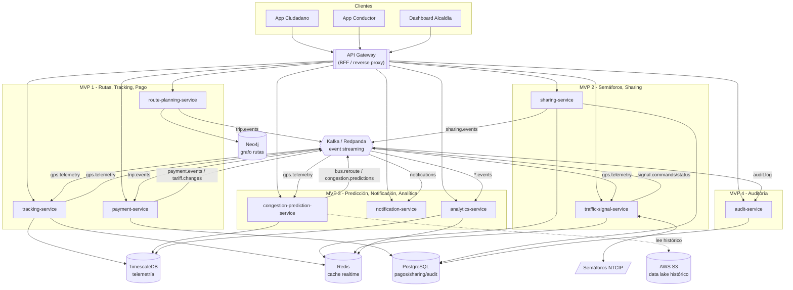

# C4 · Nivel 2 — Diagrama de Contenedores

Microservicios + event streaming (Kafka/Redpanda) + persistencia políglota.

## Responsabilidad y persistencia por servicio

| Servicio | MVP | Inciso | Base de datos | Topics que produce | Topics que consume |
|---|---|---|---|---|---|
| route-planning-service | 1 | I | Neo4j (grafo) | `trip.events` | — |
| tracking-service | 1 | II | TimescaleDB + Redis | `gps.telemetry`* | `gps.telemetry` |
| payment-service | 1 | III | PostgreSQL | `payment.events`, `tariff.changes` | `trip.events` |
| traffic-signal-service | 2 | IV | Redis | `signal.commands`, `signal.status` | `gps.telemetry`, `signal.*` |
| sharing-service | 2 | V | PostgreSQL + Redis | `sharing.events` | — |
| congestion-prediction-service | 3 | VI | TimescaleDB (+S3) | `congestion.predictions`, `bus.reroute`, `notifications` | `gps.telemetry` |
| notification-service | 3 | VII | Redis | `notifications` | `notifications`, `trip.events`, `bus.reroute` |
| analytics-service | 3 | VIII | TimescaleDB + Redis | — | `trip.events`, `payment.events` |
| audit-service | 4 | b) | PostgreSQL (append-only) | — | `audit.log` |

\* La telemetría la produce el `simulator` (o los vehículos reales); `tracking-service` la consume.

> El **EventBus** (en `shared/`) replica automáticamente todo evento de un topic
> auditable (`bus.reroute`, `tariff.changes`, `signal.commands`, `payment.events`)
> al topic `audit.log`, garantizando trazabilidad sin acoplar a cada servicio.
