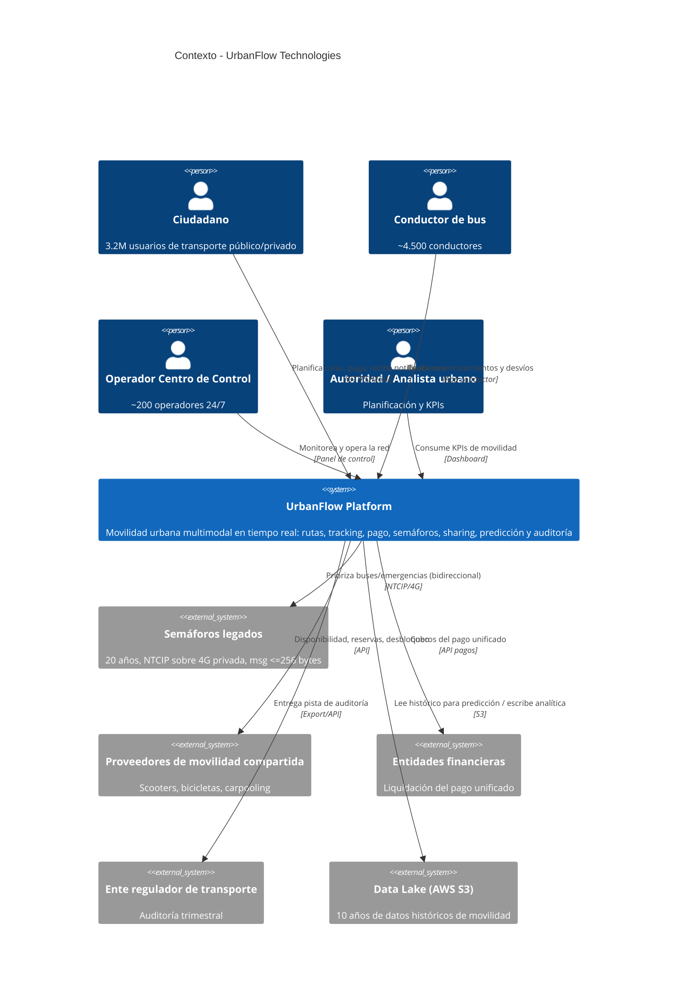

# C4 · Nivel 1 — Diagrama de Contexto

Sistema: **Plataforma Inteligente de Movilidad Urbana (UrbanFlow)**.

> Si tu visor de Markdown no soporta `C4Context`, el mismo contenido está descrito
> como grafo en [c4-container.md](c4-container.md).
