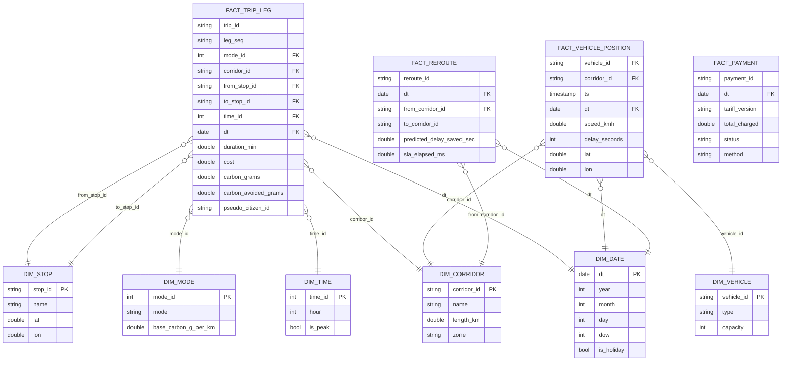

# Modelo de Datos — Data Lake de Analítica Histórica (AWS S3)

Diseño del data lake que reutiliza los **10 años de datos históricos** de la
alcaldía para: (a) alimentar el modelo de predicción de congestión y (b)
soportar la analítica histórica de movilidad y la auditoría regulatoria.

## 1. Arquitectura por zonas (medallion)

```
s3://urbanflow-datalake/
├── raw/            (Bronze)  eventos crudos tal cual salen de Kafka (JSON/Avro)
│   ├── gps_telemetry/dt=YYYY-MM-DD/hour=HH/*.json
│   ├── trip_events/dt=YYYY-MM-DD/*.json
│   ├── payment_events/dt=YYYY-MM-DD/*.json
│   ├── signal_commands/dt=YYYY-MM-DD/*.json
│   └── bus_reroute/dt=YYYY-MM-DD/*.json
├── curated/        (Silver)  limpio, tipado, deduplicado, anonimizado (Parquet)
│   ├── fact_trip_leg/dt=.../*.parquet
│   ├── fact_vehicle_position/dt=.../*.parquet
│   └── fact_payment/dt=.../*.parquet
└── aggregated/     (Gold)    tablas analíticas y features (Parquet/Iceberg)
    ├── agg_corridor_hourly/
    ├── agg_emissions_daily/
    └── feature_congestion_baseline/
```

- **Ingesta**: Kafka Connect (S3 Sink) escribe `raw/` particionado por fecha/hora.
- **ETL**: AWS Glue (PySpark) transforma `raw → curated → aggregated`.
- **Consulta**: Amazon Athena (SQL) + catálogo en Glue Data Catalog.
- **Formato**: Parquet columnar + compresión Snappy; particionado por `dt` (y `corridor_id`/`hour` donde aplica) para *partition pruning*.
- **Privacidad** (NFR): en `curated/` se aplica **privacidad diferencial** —
  el `citizen_id` se sustituye por un seudónimo rotado por día y se agregan
  trayectorias; la ubicación individual no persiste tras finalizar el viaje.

## 2. Modelo dimensional (esquema estrella) — Gold



## 3. Tablas Gold (features / KPIs precalculados)

| Tabla | Grano | Columnas clave | Uso |
|---|---|---|---|
| `agg_corridor_hourly` | corredor × hora | avg_speed, avg_delay, throughput, punctuality_pct | KPIs panel alcaldía (VIII) |
| `agg_emissions_daily` | día × zona | carbon_avoided_kg, trips, modal_split | Meta -30% CO₂ |
| `feature_congestion_baseline` | corredor × hora × dow | baseline_speed, p10/p50/p90, slope | Entrena predicción (VI) |

## 4. Gobierno y trazabilidad

- **Versionado**: tablas Gold en formato **Apache Iceberg** (time-travel, esquema evolutivo).
- **Auditoría**: `FACT_REROUTE` y `FACT_PAYMENT` conservan `reroute_id` /
  `payment_id` y `tariff_version`, enlazables con la cadena de hashes del
  `audit-service` (PostgreSQL) → trazabilidad completa exigida por el regulador.
- **Retención**: `raw` 90 días → Glacier; `curated`/`aggregated` 10 años.
- **Calidad**: AWS Glue Data Quality + Great Expectations sobre la zona `curated`.
