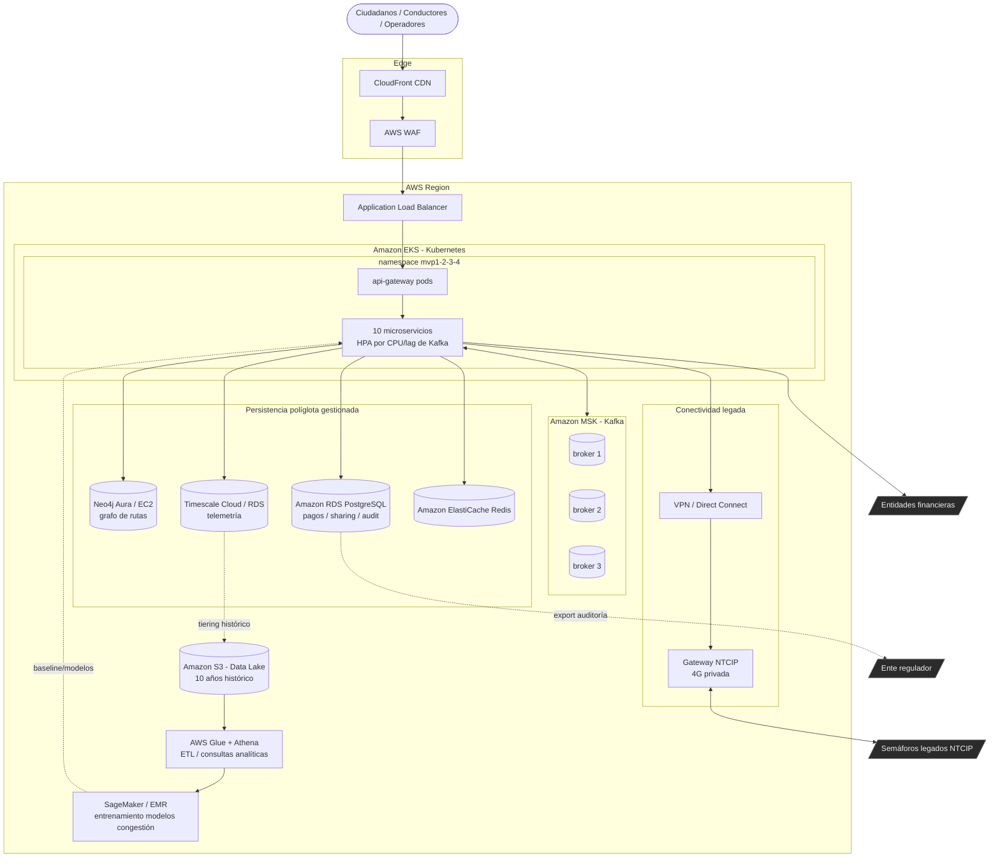

# Diagrama de Despliegue en Nube (AWS)

Despliegue objetivo en producción. La arquitectura local (docker-compose) es un
espejo de esta topología para desarrollo y demo.

## Decisiones de despliegue

- **Amazon EKS** con autoescalado horizontal (HPA) por CPU y por *consumer lag*
  de Kafka, para absorber los picos de 7-9 AM y 5-7 PM (>50.000 ev/s).
- **Amazon MSK** (Kafka gestionado) multi-AZ, replicación factor 3 → disponibilidad 99.95%.
- **Persistencia políglota gestionada**: RDS Multi-AZ (pagos/auditoría),
  Timescale (telemetría), Neo4j (rutas), ElastiCache (cache realtime).
- **Data Lake S3** + Glue/Athena para analítica histórica y SageMaker/EMR para
  reentrenar el modelo de predicción de congestión.
- **Gateway NTCIP** dedicado sobre VPN/Direct Connect hacia la red 4G privada
  de los semáforos (mensajes ≤256 bytes).
- **Multi-AZ + health checks + readiness/liveness** para tolerancia a fallos.
