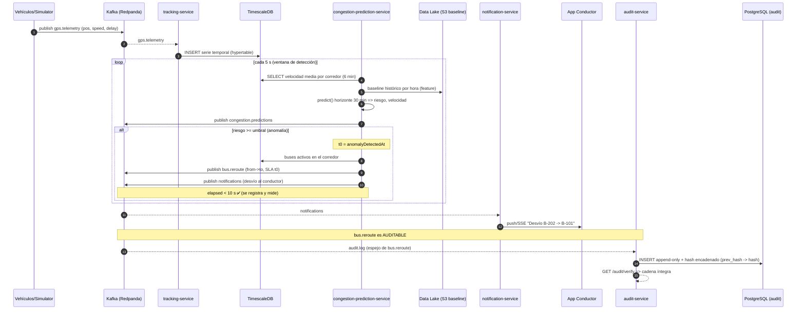

# Diagrama de Secuencia — Flujo de Re-enrutamiento de Bus

Cumple los incisos VI (predicción + re-enrutamiento), VII (notificación al conductor)
y el inciso b) del Contexto Adicional (trazabilidad). NFR clave: el re-enrutamiento
debe ejecutarse en **menos de 10 segundos** desde la detección de la anomalía.

## Notas de cumplimiento

- **< 10 s**: la detección (consulta a TimescaleDB) y la emisión de `bus.reroute`
  ocurren en el mismo ciclo del `congestion-prediction-service`; se calcula
  `elapsedMs = now - anomalyDetectedAt` y se registra `withinSLA`.
- **Trazabilidad**: el `EventBus` espeja `bus.reroute` a `audit.log`; el
  `audit-service` lo persiste en una **cadena de hashes** append-only
  (tamper-evidence) verificable vía `GET /api/audit/audit/verify`.
- **Desacople**: ningún servicio llama a otro de forma síncrona en el camino
  crítico; todo fluye por eventos, lo que sostiene los >50.000 ev/s en hora pico.
